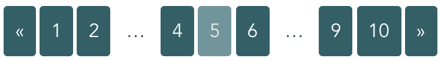

[TODO:] [Insert] [a crapton] [of badges] [here] [because] [javascript]

# Sliding Pagination for Vue

> ARIA-friendly pagination component with a sliding window.



**Disclaimer**: This package is currently still in beta and **not recommended** for production use yet.

## Installation

### Node

`npm install vue-sliding-pagination --save`

or, for the fäncÿ people,

`yarn add vue-sliding-pagination`

### Browser

Currently, no browser build is available.

## Usage

Basic usage of the pagination component only requires the current page,
the total number of pages and a handler which is called on page change.

The pagination component **does not handle page changes by itself**, instead
you are required to provide a page change handler which should contain
all your page changing logic (e.g. a vuex store dispatch) and eventually
change the current page to the passed one. In later releases, a v-model
approach to `currentPage` may be offered, but was opted against for the time
being.

Thus, to get a paginator with default settings (please consult the options listing
below for details), the following markup and script sections provide a starting
point:

```html
<sliding-pagination
  :current="currentPage"
  :total="totalPages"
  @page-change="pageChangeHandler"
></sliding-pagination>
```

```js
import SlidingPagination from 'vue-sliding-pagination'

// in component or vue instance
components: {
  // ...
  SlidingPagination
},
data() {
  return {
    // ...
    currentPage: 1,
    totalPages: 10
  }
},
methods: {
  // ...
  pageChangeHandler(selectedPage) {
    this.currentPage = selectedPage
  }
}
```

## Options

| name                  | type   | default                                   | description                                                   |
|-----------------------|:------:|-------------------------------------------|---------------------------------------------------------------|
| ariaPaginationLabel   | String | `'Pagination navigation'`                 | ARIA label for the whole <nav> area                           |
| ariaGotoPageLabel     | String | `'Go to page %page% of %total%'`          | ARIA label for a page link that is not the current page       |
| ariaPreviousPageLabel | String | `'Go to previous page'`                   | ARIA label for the previous page action                       |
| ariaNextPageLabel     | String | `'Go to next page'`                       | ARIA label for the next page action                           |
| ariaCurrentPageLabel  | String | `'Page %current of %total, current page'` | ARIA label for the current page                               |
| current               | Number | -                                         | Integer representing the current page                         |
| total                 | Number | -                                         | Integer representing the total number of pages                |
| slidingEndingSize     | Number | `2`                                       | Number of always listed pages on the beginning and end        |
| slidingWindowSize     | Number | `3`                                       | Number of pages in the sliding window                         |
| nonSlidingSize        | Number | `9`                                       | Number of pages before the paginator switches to sliding mode |
| pageComponent         | String | `'sliding-pagination-default-page'`       | Component name (must be registered) for the page elements     |

## Customization

The component offers severals customization options.

### ARIA labels

All ARIA labels can be altered and localized.

The labels `ariaGoToPageLabel` and `ariaCurrentPageLabel` support
the following template variables:

| Variable  |  Type  | Description               |
|-----------|:------:|---------------------------|
| `%total%` | Number | The total number of pages |
| `%page%`  | Number | The page under the cursor |

### Intervals

The number of pages shown on the beginning and ending of the pager
as well as the number of pages in the pagination window can be changed
dynamically. The break-point from normal to sliding-window pagination
can also be adjusted. **Please bear in mind that none of these intervals
and none of the calculations they are used in make any assertions on
obviously impossible configurations!**

_What are obviously impossible configurations?_

Glad you're asking! For one, the rule of thumb should be
`2 * slidingEndingSize + slidingWindowSize <= total`.
However, as there is a fallback coated as `nonSlidingSize` you can work around
this "limitation" with some ingenouity on your part. Basically, don't do stupid things
that disregards principles of natural numbers.

### Page navigation

The content of the previous and next page elements are customizable via the
slots `previous-page` and `next-page`. By default, these only contain
the "pretend arrows" aka &laquo; and &raquo;. The contents of these slots
are **only intended for visual use**. Screenreader users are presented
the `ariaPreviousPageLabel` and `ariaNextPageLabel` instead.

### Gaps

Depending on the current page, there may be a gap between the sliding window and the
beginning and ending pages. The gap content defaults to &hellip; but can be
customized **for visual use** under the same conditions as the page navigation with
the slots `gap-left` and `gap-right`.

### Page component

Since actual pages are the most active element of the whole pagination deal,
they have been implemented with the `<component :is="paginationComponent">` pattern.

The `SlidingPaginationDefaultPage` component offers guidance into how a basic
component representing page elements should look like. It's unit test can
be used as a basis for unit testing custom page components.

The page component receives the following props:

| name          |   type  | description                  |
|---------------|:-------:|------------------------------|
| ariaPageLabel | String  | The computed ARIA page label |
| isCurrent     | Boolean | Is the page the current page |
| page          | Number  | The page number to display   |

It is by no means required to implement all properties of the default page.
A custom pagination component can usually just be implemented as render
function, e.g.

```js
Vue.component('ExamplePageComponent', {
  props: {
    page: {
      type: Number,
      required: true
    }
  },

  render (h) {
    return h('a', { class: 'page-component' }, this.page)
  }
})
```

```html
<sliding-pagination
  ...
  pagination-component="example-page-component"
></sliding-pagination>
```

_Please keep in mind that the above example is absurdly simple for demonstration purposes
and breaks the ARIA compatibility of the whole pagination component._

### Styling

The CSS classes used in the component are following the [BEM](http://getbem.com/introduction/)-Methodology,
regarding **only** the component itself as a block and going downward from there, thus the
corresponding classes to interface elements are:

| Class                                         | Interface element                                                |
|-----------------------------------------------|------------------------------------------------------------------|
| .c-sliding-pagination                         | The whole component i.e. the `<nav>` container                   |
| .c-sliding-pagination__list                   | The `<ul>` containing all navigational and page elements         |
| .c-sliding-pagination__list-element           | Each `<li>` representing either a navigational or a page element |
| .c-sliding-pagination__list-element--active   | The `<li>` representing the current page                         |
| .c-sliding-pagination__list-element--disabled | Disabled navigational elements                                   |
| .c-sliding-pagination__page                   | The page element inside an `<li>` (typically an `<a>`)           |

For ease of customization, the original SCSS styling files are available in the distribution package
in the `dist/styles` subdir.

## Contributing

Please do. Please be kind to each other. That's all.

## License

Copyright 2018 Stefan "eFrane" Graupner

Permission is hereby granted, free of charge, to any person obtaining a copy of this
software and associated documentation files (the "Software"), to deal in the Software
without restriction, including without limitation the rights to use, copy, modify, merge,
publish, distribute, sublicense, and/or sell copies of the Software, and to permit
persons to whom the Software is furnished to do so, subject to the following conditions:

The above copyright notice and this permission notice shall be included in all copies or
substantial portions of the Software.

THE SOFTWARE IS PROVIDED "AS IS", WITHOUT WARRANTY OF ANY KIND, EXPRESS OR IMPLIED,
INCLUDING BUT NOT LIMITED TO THE WARRANTIES OF MERCHANTABILITY, FITNESS FOR A PARTICULAR
PURPOSE AND NONINFRINGEMENT. IN NO EVENT SHALL THE AUTHORS OR COPYRIGHT HOLDERS BE LIABLE
FOR ANY CLAIM, DAMAGES OR OTHER LIABILITY, WHETHER IN AN ACTION OF CONTRACT, TORT OR
OTHERWISE, ARISING FROM, OUT OF OR IN CONNECTION WITH THE SOFTWARE OR THE USE OR OTHER
DEALINGS IN THE SOFTWARE.
